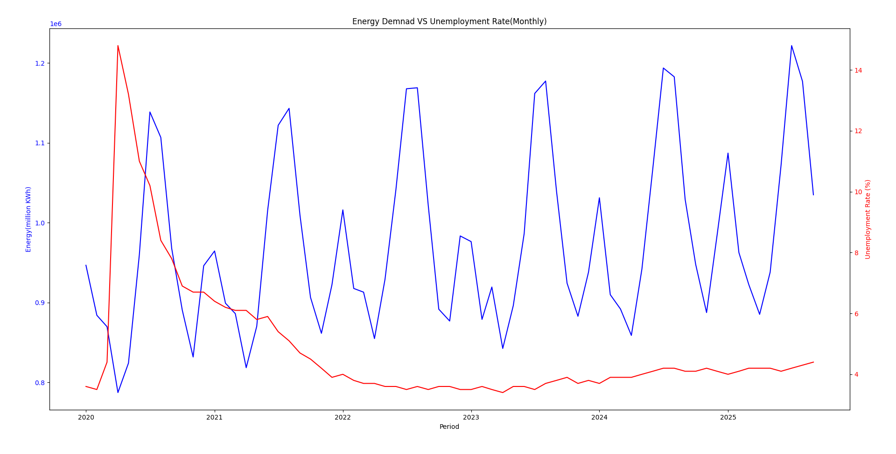

# Energy Demand vs Economic Analysis Pipeline
## 📌 Project Overview

This project is a data engineering pipeline that pulls U.S monthly electricity consumption data from the EIA API, combines it with unemployment rates, transforms and stores it in a MySQL database, and produces visual insights on the relationship between energy demand and unemployment over time.

The pipeline demonstrates end-to-end data handling, including extraction, transformation, loading(ETL), and visualization.

## 🛠️ Tech Stack & Tools
- Python -core programming language for ETL and visualization
- PANDAS -Data transforming and cleaning
- Requests -Pull data from APIs
- Matplotlib & Seaborn -Data visualization
- MySQL Server & Workbench -Data storage and management
- dotenv -Environment variable mangement for API keys and passwords
- VS CODE -Code Editor

## ⚙️ Features
- Fetches monthly energy consumption from EIA API
- Fetches monthly unemployment rate from FRED API
- Transforms and merges datasets for analysis
- Loads merged data into a MySQL database
- Generates Visualization showing trends and correlation between energy demand and unemployment
- Fully modular and reusable pipeline for future datasets

## 🧰 Backend Setup / Prerequisites
Before running the pipeline, install the following libraries and tools:

### Python Libraries

pip install pandas requests mysql-connector-python matplotlib seaborn python-dotenv

## System/External Tools
- MySQL Server & Workbench(for databse storage)

## Data Sources
- US Energy Information Administration (EIA): Monthly electricity consumption
    https://www.eia.gov/opendata/
- US Bureau of Labor Statistics (BLS): Monthly unemployment rate
    https://fred.stlouisfed.org/

## Environmental Variables
Create a .env file in the project root with the following:
- EIA_API_KEY = your_eia_api_key
- FRED_API_KEY = your_fred_api_key
- MYSQL_PASSWORD = your_mysql_root_password
    
## Insights
- Visualizes correlation between energy consumption and unemployment rate
- Highlights trends over time, e.g, economic downturns reflected in reduced energy usage

## Future Improvements
- Add state-level or sector-level energy breakdown
- Add more economic indicators(GDP,inflation)
- Interactive Dashboard using Plotly or Streamlit

## Quick summary
This project is an **end-to-end ETL pipeline** that :
- Extracts U.S. monthly energy consumption and unemployment data
- Transforms and merges datasets for analysis
- Loads the cleaned data into a **MySQL database**
- Visualizes trends and correlations between **energy demand** and **unemployment**

